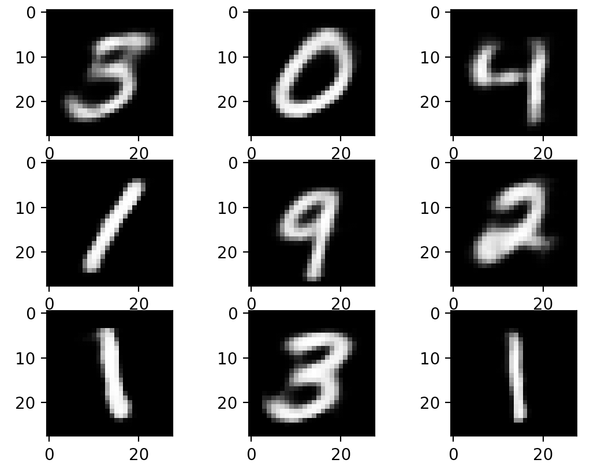

# Autoencoder for MNIST

## Get started

To get started after cloning the repository you just need to type the following command

````
pip install -r requirements
````

## Run it

just type the following in your command line

````
python start.py
````

#### Trained Output

